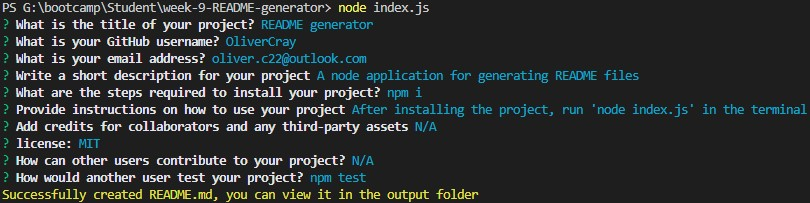

# week-9-README-generator

## Purpose of Task

Use of a command-line application to allow users to quickly generate high quality README files. After running the application in the terminal, the user will be prompted with multiple questions, the answers to which will then be used to generate their README. This file will be placed in the **output** folder. This will be a Node application making use of the inquirer and fs modules.

## User Story

```md
AS A developer
I WANT a README generator
SO THAT I can quickly create a professional README for a new project
```

## Acceptance Criteria

```md
GIVEN a command-line application that accepts user input
WHEN I am prompted for information about my application repository
THEN a high-quality, professional README.md is generated with the title of my project and sections entitled Description, Table of Contents, Installation, Usage, License, Contributing, Tests, and Questions
WHEN I enter my project title
THEN this is displayed as the title of the README
WHEN I enter a description, installation instructions, usage information, contribution guidelines, and test instructions
THEN this information is added to the sections of the README entitled Description, Installation, Usage, Contributing, and Tests
WHEN I choose a license for my application from a list of options
THEN a badge for that license is added near the top of the README and a notice is added to the section of the README entitled License that explains which license the application is covered under
WHEN I enter my GitHub username
THEN this is added to the section of the README entitled Questions, with a link to my GitHub profile
WHEN I enter my email address
THEN this is added to the section of the README entitled Questions, with instructions on how to reach me with additional questions
WHEN I click on the links in the Table of Contents
THEN I am taken to the corresponding section of the README
```

## Problems Solved

- When the user runs the application, they are prompted to answer a number of questions
    - The answers to these questions are used to generate their README
- When the user enters their project title, it is displayed as the title of their README
- When the user enters a description, installation instructions, usage information, credits, contribution guidelines and test instructions, these answers are added to their respective sections in the README
- When the user chooses a license, a bade for that license is displayed under the title and the Lincese section of the README is populated to show that the application is covered by that license
- When the user enters their username and email address, they are added to the questions section
- When the user clicks on any of the links in the table of contents, they are taken to the correct section of the README

## Screenshot

 

## Demonstration Video

A demonstration video is availabe here: https://drive.google.com/file/d/14VPWO6lP8tueFVxjuQwnMKEKvED6KRTc/view